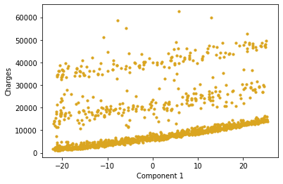
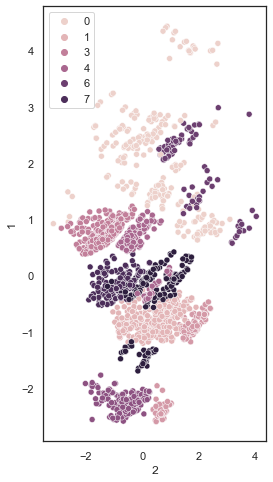
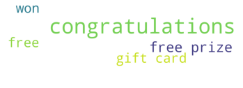
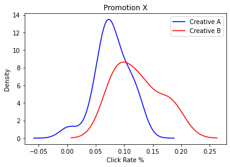

<h1 align="center">
  <b>Welcome to my portfolio!</b>  
</h1>

Hi my name is Arthur. I recently graduated <em>magna cum laude</em> with a bachelor’s degree in pharmacology and economics. I currently work in email marketing as an analyst with prior experience as a digital media data science intern. I am passionate about using programming languages to derive meaningful insights to drive impactful data solutions. This portfolio consists of various projects I have completed on the side for fun, as well as some examples of projects that I have used to optimize my marketing campaigns to increase revenues and decrease operating expenses.

# [Project 1: Insurance Charges Prediction (Regression)](https://github.com/ArthurSarkissyan/Insurance-Charges-Prediction/blob/main/Insurance%20Charges%20Prediction%20(Regression).ipynb)
- There are a lot of factors that affect someone's health insurance costs.
- Here I tried to predict a person's insurance costs based on age, sex, bmi, amount of children, whether or not they smoke, and where they live.
- I tested linear regression (with lasso, ridge, and elastic net regularizations) as well as random forest regression. 
- Principal component analysis (PCA) was used to reduce dimensionality for facilitated visualization.

# [Project 2: Customer Segmentation (Clustering)](https://github.com/ArthurSarkissyan/Customer-Segmentation/blob/main/Customer%20Segmentation%20(Clustering).ipynb)
- With appropriate data, it is possible to split up customers into different clusters so that they can be selectively targeted by marketing campaigns.
- The goal of this project is to split the customers of a store into 8 to 10 different clusters to allow for selective targeting.
- The clustering techniques that were tested were k-means clustering, agglomerative clustering, and DBSCAN.
- Principal component analysis (PCA) was used to reduce dimensionality for facilitated visualization.

# [Project 3: Email Spam Detector (NLP and Classification)](https://github.com/ArthurSarkissyan/Email-Spam-Classifier-Example/blob/main/Email%20Spam%20Classifier%20Example.ipynb)
- The goal of an email marketer is to get people to click on their emails.  In order to generate high clicks, the emails need to land in the inbox.
- There are many factors that can lead to spam, but one of the main things that can lead to spam are spammy keywords and phrases.
- This is an example of a spam classifier that uses natural language processing (NLP) to classify emails using a fake email dataset. 
- The models that are tested are Multinomial Naive Bayes, Logistic Regression, Random Forest Classification, Support Vector Classification, and K-Nearest Neighbor Classification.
- This can be used to reduce instances of spamming.

# [Project 4: Email Creative A/B Test Analysis](https://github.com/ArthurSarkissyan/Email-Creative-T-Test-Example/blob/main/Simple%20Creative%20T-test.ipynb)
- In email marketing, a creative is the actual advertisement that is sent to the target.
- A campaign can have multiple creatives, where some creatives perform better than others.
- This is an example of a t-test done to analyze the result of an A/B test of an email marketing campaign.
- The metric that is being analyzed is the click through rate, which is the percentage of people who clicked on the advertisement.

