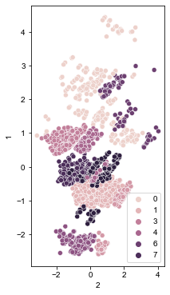

<h1 align="center">
  <b>Welcome to my portfolio!</b>  
</h1>

Hi my name is Arthur. I graduated magna cum laude with a bachelor’s degree in pharmacology and economics, and I recently obtained a second bachelor's degree in computer science. I have digital marketing and business intelligence experience with the hopes of continuing my career in a more technical role. I am passionate about using programming languages to drive impactful data solutions. This portfolio consists of various projects I have completed for fun and for school, as well as some examples of projects that I have used to optimize my marketing campaigns.

# Data Science:

## [Project 1: Insurance Charges Prediction (Regression)](https://github.com/ArthurSarkissyan/Insurance-Charges-Prediction/blob/main/Insurance%20Charges%20Prediction%20(Regression).ipynb)
- There are a lot of factors that affect someone's health insurance costs.
- Here I tried to predict a person's insurance costs based on age, sex, bmi, amount of children, whether or not they smoke, and where they live.
- I tested linear regression (with lasso, ridge, and elastic net regularizations) as well as random forest regression. 
- Principal component analysis (PCA) was used to reduce dimensionality for facilitated visualization.

## [Project 2: Customer Segmentation (Clustering)](https://github.com/ArthurSarkissyan/Customer-Segmentation/blob/main/Customer%20Segmentation%20(Clustering).ipynb)
- With appropriate data, it is possible to split up customers into different clusters so that they can be selectively targeted by marketing campaigns.
- The goal of this project is to split the customers of a store into 8 to 10 different clusters to allow for selective targeting.
- The clustering techniques that were tested were k-means clustering, agglomerative clustering, and DBSCAN.
- Principal component analysis (PCA) was used to reduce dimensionality for facilitated visualization.

## [Project 3: Email Spam Detector (NLP and Classification)](https://github.com/ArthurSarkissyan/Email-Spam-Classifier-Example/blob/main/Email%20Spam%20Classifier%20Example.ipynb)
- The goal of an email marketer is to get people to click on their emails.  In order to generate high clicks, the emails need to land in the inbox.
- There are many factors that can lead to spam, but one of the main things that can lead to spam are spammy keywords and phrases.
- This is an example of a spam classifier that uses natural language processing (NLP) to classify emails using a fake email dataset. 
- The models that are tested are multinomial naive bayes, logistic regression, random forest classification, support vector classification, and k-nearest neighbor classification.
- This can be used to reduce instances of spamming.

# Software Engineering:

## [Project 4: Traveling Salesman Problem (OOP)](https://github.com/ArthurSarkissyan/SLC-WGUPS)
- This is a project that was done for my CS degree.
- There are three trucks that need to deliver 40 packages in Salt Lake City, with various constraints.
- The nearest neighbor algorithm was used as a solution to this instance of the traveling salesman problem.
- A hash table was created from scratch to efficiently map the pacakges.
- Object oriented programming techniques were used for organization and reusability purposes.

